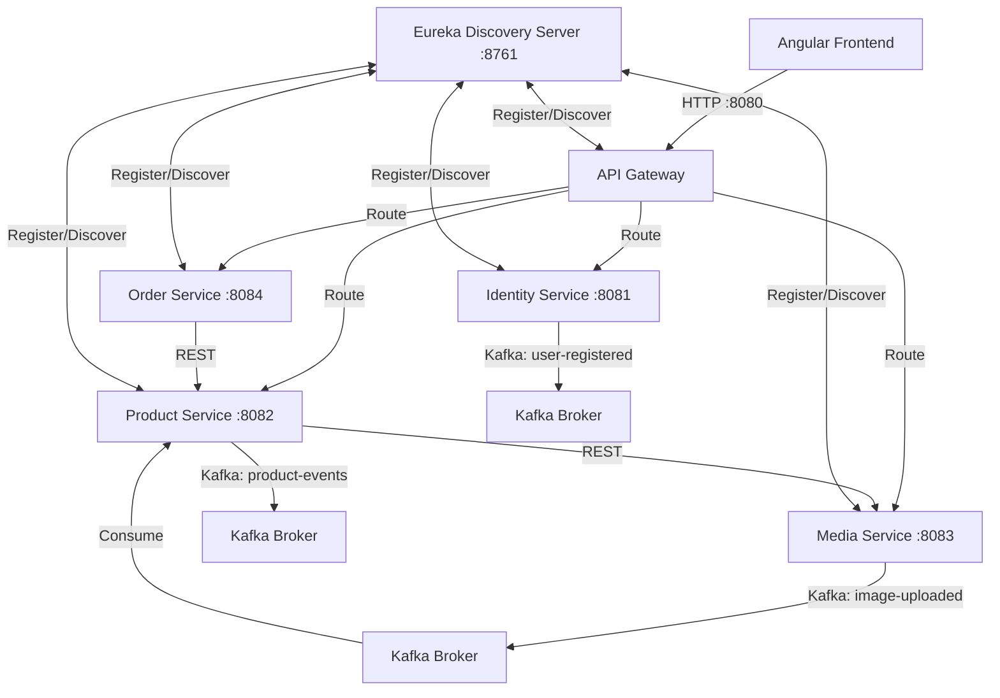

# E-Commerce Microservices Platform

Welcome to the fully completed e-commerce platform codebase. This repository comprises a robust, cloud-native microservices architecture designed to provide a secure, scalable, and responsive online shopping environment.

---

## 1. Project Overview & Features

This platform integrates a modern Angular frontend with a Java Spring Boot backend, orchestrating data transactions across MongoDB databases and synchronizing states using Apache Kafka events.

### Core Implemented Features:
1.  **Shopping Cart System**:
    *   Fully persisted inside MongoDB (per user session).
    *   Supports real-time stock checks against catalog quantities.
    *   Add items, update quantities, remove items, and clear cart actions.
2.  **Checkout & Order Processing**:
    *   Converts cart items to Pending Orders with a 25% VAT tax calculation.
    *   Enables checkout using the default "Pay on Delivery" (`PAY_ON_DELIVERY`) option.
3.  **Order Management**:
    *   Track order state transitions: `PENDING` ➔ `PROCESSING` ➔ `SHIPPED` ➔ `DELIVERED`.
    *   Order cancellation: Releases reserved stock, updating inventory counts back to catalog in MongoDB, and adjusts seller revenue.
    *   Order duplication (Buy Again): Re-populates cart with historical order items for checkout.
4.  **Keyword Search & Advanced Filtering**:
    *   Full-text search matching name and description keywords.
    *   Filters by category and price range bounds (min/max).
    *   Sort products by Popularity (Sales Count), Price (Ascending/Descending), Alphabetical Name, or Newest.
5.  **User & Seller Profiles**:
    *   **Buyer Profile**: Displays total orders count, total spent money, and a breakdown of the top 5 most bought items.
    *   **Seller Dashboard**: Displays product listings management, total products sold, total accrued revenue, and top 5 best-selling products.
6.  **Wishlist (Bonus Feature)**:
    *   Save products for future purchases.
    *   Puts pinned wishlist items directly into the cart.
    *   Displays wishlist count badges inside the Navigation bar.

---

## 2. Microservices Architecture

The platform is divided into decoupled, single-responsibility services:



### Downstream Microservices:
*   **`discovery-server` (Port 8761)**: Serves as the Eureka Service Registry.
*   **`api-gateway` (Port 8080)**: Single entryway handling CORS configuration and JWT claim extraction (propagates `X-User-Id` headers downstream).
*   **`identity-service` (Port 8081)**: Manages accounts, hashes passwords using BCrypt, generates JWT tokens, and aggregates user spent details.
*   **`product-service` (Port 8082)**: Manages catalog listings, search indexes, wishlists, and seller sales aggregations.
*   **`media-service` (Port 8083)**: Secure image uploads, validates magic bytes (protects against MIME-type spoofing), and writes files to disk.
*   **`order-service` (Port 8084)**: Cart transactions, checkout handling, order lifecycle updates, and buyer purchases analytics.
*   **`buy-01-frontend` (Port 80/4200)**: Desktop and mobile responsive Angular UI.

---

## 3. Tech Stack & Infrastructure

*   **Core Backend**: Java 21, Spring Boot 3.2, Spring Cloud Gateway, Netflix Eureka.
*   **Core Frontend**: Angular 17+, Bootstrap, SCSS.
*   **Databases**: MongoDB.
*   **Messaging**: Apache Kafka (Zookeeper orchestrated).
*   **DevOps & CI/CD**: Jenkins, Docker, Nginx, SonarQube.

---

## 4. Setup & Running Locally

### Prerequisites
*   Docker & Docker Compose
*   Maven 3.8+
*   Node.js 18+ & Angular CLI

### Fast Start (Docker Orchestrated)
Start the entire ecosystem including databases, brokers, and microservices with a single command:
```bash
# Start all containers in the background
docker compose up -d

# Verify all services are healthy
docker compose ps
```
The application will be accessible at `https://localhost` (or `http://localhost`).

### Manual Local Development Startup

1.  **Start Services Registry**:
    ```bash
    cd discovery-server
    mvn spring-boot:run
    ```
2.  **Start Support Databases/Brokers**:
    ```bash
    # Runs Mongo, Kafka, and Zookeeper
    docker compose up -d mongodb kafka zookeeper
    ```
3.  **Start Services**:
    Run `mvn spring-boot:run` inside `identity-service`, `product-service`, `media-service`, `order-service`, and `api-gateway` directories.
4.  **Start Angular UI**:
    ```bash
    cd buy-01-frontend
    npm install
    npm run start # Access at http://localhost:4200
    ```

---

## 5. CI/CD & Code Quality (Jenkins & SonarQube)

This project adopts software engineering best practices with an automated CI/CD pipeline defined in the `Jenkinsfile`:
*   **Build & Tests Execution**: Automatically compiles and executes unit tests on PR events (`mvn clean verify`).
*   **Quality Gates Analysis**: Performs deep code inspection using SonarQube (`mvn sonar:sonar`) to flag Bugs, Vulnerabilities, Code Smells, and Code Coverage issues.
*   **Automatic Deployment**: Compiles production bundles, tags Docker image backups (`buy-01-dev-<service>:backup`), and deploys new builds to the runtime system.
